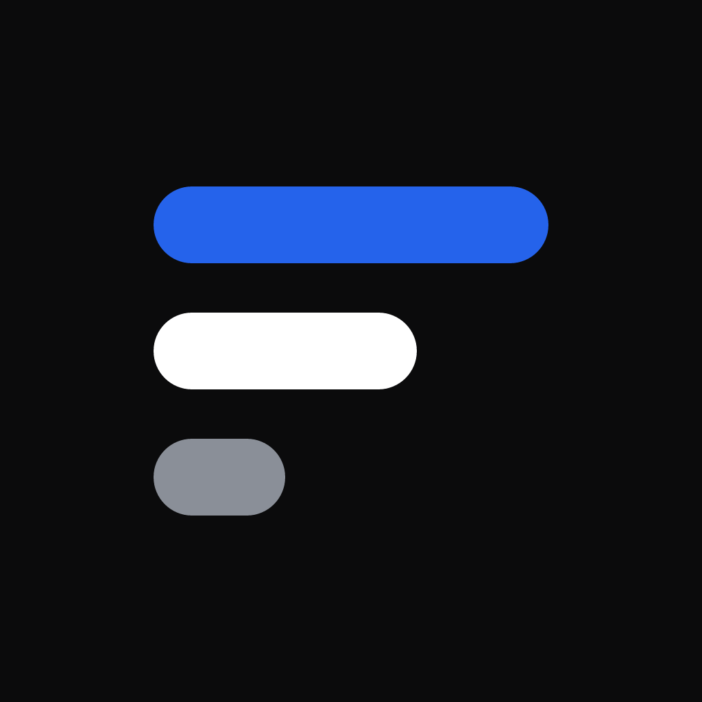

<p align="center">
  
</p>

<h1 align="center">AI Usage</h1>

<p align="center">
  一眼看清你的 AI 订阅还剩多少：用量、剩余额度、重置时间，全都在手机上。
</p>

<p align="center">
  <a href="https://github.com/nextroad-dev/aiusage/releases/latest">下载最新版</a> ·
  <a href="#支持的服务">支持的服务</a> ·
  <a href="#隐私">隐私</a> ·
  <a href="https://afdian.com/a/nextroad">赞助</a>
</p>

---

同时用着 ChatGPT、Copilot、OpenRouter、Kimi……每家的额度规则都不一样：5 小时窗口、每周上限、按月重置、预付余额。AI Usage 把它们放在同一个地方，告诉你**哪个快用完了、什么时候恢复**，免得在关键时刻被限流。

## 功能

- **中转站一键接入**：New API、Sub2API、One API 等中转站只需地址和 Key，自动识别站点和余额。
- **所有订阅一屏看完**：每个账号的每个额度窗口（5 小时、每周、每月、余额）用横条显示已用与剩余，附重置倒计时；最需要注意的账号排在最前面。
- **用完预测**：按你当前的消耗速度，估算什么时候会用完——如果早于重置就提前告诉你。
- **Codex 全局辅助信息**：默认关闭。在 ChatGPT / Codex 详情页的「重置概率」点「开启」，同意独立第三方 [codex-reset.com](https://codex-reset.com/) 数据来源后，只在该详情页显示未来 24 / 48 小时的全局重置概率。开关对所有 Codex 账号生效；取消同意或关闭后不请求该来源。不会向其发送 API Key、ChatGPT Token、账户 ID 或个人用量。它不是 OpenAI 官方个人额度 API；预测不保证个人额度恢复，也不会修改个人窗口重置时间。过期缓存会明确标注。
- **订阅与花费**：显示服务商返回的套餐到期 / 续费日；为每个账号填上月费，首页汇总你每月在 AI 订阅上花了多少。
- **及时提醒**：用量超过你设的阈值、用满（100%）的窗口重置后额度恢复、套餐快到期、登录失效时，发本地通知提醒你。
- **小组件**（iOS）：主屏和锁屏小组件，不打开应用也能看余量。
- **好用的细节**：中文 / English（可跟随系统）、浅色 / 深色、7 种主题色、流畅的动画与触觉反馈，并尊重系统的「减弱动态效果」。

## 下载与安装

前往 [Releases](https://github.com/nextroad-dev/aiusage/releases/latest) 下载最新版本。

### Android

下载 `AIUsage-*-arm64-v8a.apk`（绝大多数手机）；较旧的 32 位手机选 `armeabi-v7a`，不确定就选 `universal`（通用包，体积最大）。在手机上打开安装（首次需要允许「安装未知来源应用」）。

### iOS

下载 `AIUsage-*-unsigned.ipa`。这是**未签名**的安装包，需要用 [Sideloadly](https://sideloadly.io/) 或 [AltStore](https://altstore.io/) 配合你的 Apple ID 签名后安装：

1. 在电脑上安装 Sideloadly（Windows 还需要安装官网版 iTunes），用数据线连接 iPhone。
2. 把 IPA 拖进 Sideloadly，填入 Apple ID，点击 Start。
3. 在 iPhone「设置 → 通用 → VPN 与设备管理」中信任该开发者。
4. iOS 16 及以上需打开「设置 → 隐私与安全性 → 开发者模式」。

> 使用免费 Apple ID 签名时：应用 7 天后需要重新签名（数据会保留）；免费账号不支持 App Group，主屏小组件不会显示数据，其他功能正常。

## 支持的服务

| 服务 | 连接方式 | 显示内容 |
|---|---|---|
| ChatGPT / Codex | 浏览器登录 | 5 小时窗口、每周窗口、额度余额、套餐有效期；独立第三方全局重置概率 |
| GitHub Copilot | 个人访问令牌（Token） | Premium 请求、Chat、代码补全用量 |
| OpenRouter | 浏览器登录 / API Key | 额度余额、Key 限额、今日 / 本周 / 本月花费 |
| Cline / ClinePass | API Key | ClinePass 的 5 小时 / 每周 / 每月用量与套餐到期日；额度余额（含组织余额） |
| **中转站**（New API、Sub2API、One API 等） | 站点地址 + API Key | Key 额度、已用、剩余余额（按站点设置的货币显示） |
| OpenAI 开放平台 | Admin API Key | 组织本月与今日花费 |
| Anthropic 开放平台 | Admin API Key | 组织本月与今日花费 |
| Kimi Code | API Key | 5 小时窗口、每月额度 |
| Kimi 开放平台 | API Key | 可用余额 |
| MiniMax Token Plan | API Key | 5 小时窗口 |
| GLM Coding Plan（z.ai） | API Key | Token 用量 |
| DeepSeek 开放平台 | API Key | 可用余额 |
| Poe | API Key | 积分余额 |
| Runway 开放平台 | API Key | API 积分余额（不含网页订阅积分） |
| Command Code | API Key | 5 小时 / 每周窗口与各类积分（实验性接口） |
| OpenCode Go | API Key | Go 订阅额度 |

- **浏览器登录**：在系统浏览器里完成授权，自动回到应用，无需复制任何验证码。
- **OpenRouter** 浏览器授权会生成一个属于你的 API Key；查看整个账户余额需要 Management Key。
- **中转站**：只需填写站点地址和 Key，点「智能识别」后自动判断程序类型（New API / Sub2API / One API / OpenAI 兼容）、读取站点名称和余额；之后刷新直接使用识别出的方式查询，失效时才重新识别。
- **OpenAI / Anthropic 开放平台**需要组织的 Admin API Key（普通项目 Key 无权读取费用）；两家都不提供余额接口，因此显示花费。
- **暂不支持**：Claude / Claude Code 订阅（Anthropic 条款不允许第三方读取用量）、Cursor、OpenCode Zen、MiniMax 与智谱 GLM 的开放平台按量余额（暂无公开的余额接口）、Google Antigravity（只能借用 Google 官方客户端的 OAuth 凭据登录）。

> 部分服务的用量接口并非官方公开 API，服务商调整后可能暂时失效；遇到问题欢迎提 [Issue](https://github.com/nextroad-dev/aiusage/issues)。

## 隐私

- **没有服务器**：应用直接向各服务商请求个人用量。全局重置模块直接读取 Codex Reset 的公开数据，不发送 ChatGPT Token、账户 ID 或个人用量。
- **凭据只存在本机**：API Key 和登录令牌保存在系统钥匙串（iOS Keychain / Android Keystore）中，不会上传。
- **用量历史只存在本机**：保存在应用的本地数据库里，可在「设置 → 数据」一键全部删除。
- **无广告、无统计**：不收集任何使用数据。
- **第三方公共数据**：只有同意来源并开启开关后，应用才在前台及系统允许的后台刷新中读取 Codex Reset；关闭会隐藏模块并中止进行中的公共请求。只请求概率这一个接口，至少间隔 5 分钟，缓存保存在本机；网络失败可显示旧数据，第三方不可访问不代表 Codex 故障。展示概率的区域提供可点击的 `Data: codex-reset.com` 署名，遵循其 [接口文档](https://codex-reset.com/developers) 和 [使用条款](https://codex-reset.com/terms)。
- 浏览器登录使用本机 `127.0.0.1` 临时回调，只在登录过程中短暂开启，授权完成后立即关闭。

## 常见问题

**为什么数据不是实时的？**
打开应用时会自动刷新，也可以点右上角的刷新按钮。后台刷新由系统调度，频率取决于你使用应用的习惯。

**「按当前速度约 X 后用完」准吗？**
它按本周期内的平均消耗速度线性估算，适合判断「今天会不会被限流」，不代表精确时间。

**Codex 全局重置概率代表我的额度会恢复吗？**
不代表。它是 Codex Reset 对额外全局重置的预测，不是个人额度倒计时。个人额度仍以账户接口及 ChatGPT / Codex 本身为准。本版本不提供全局重置通知。

## 参与开发

基于 React Native + Expo，Windows 上即可开发：

```bash
npm install
npm run check         # 类型检查 + lint + 测试
npx expo start        # 启动开发服务器
```

- Expo Go 可以运行本应用，但浏览器登录回调、主屏小组件和后台刷新需要原生构建。
- `tools/probe` 可用真实账号验证服务商接口（`node tools/probe/probe.mjs list`）。
- 公共数据契约、缓存与限流、故障隔离及移动端验证清单见 [Codex Reset 集成说明](docs/codex-reset.md)。
- 推送 `v*` 标签（如 `v1.0.3`）会通过 GitHub Actions 自动构建 Android APK 与未签名 iOS IPA，并发布到 Releases。发布前先在 `.github/changes/<标签>.md` 写好该版本的更新日志，并同步修改 `app.json` 中的 `version`；Release 说明会自动拼接更新日志与安装指南。

## 赞助

AI Usage 免费且没有广告。如果它对你有帮助，欢迎在 [爱发电](https://afdian.com/a/nextroad) 支持开发 ❤️
